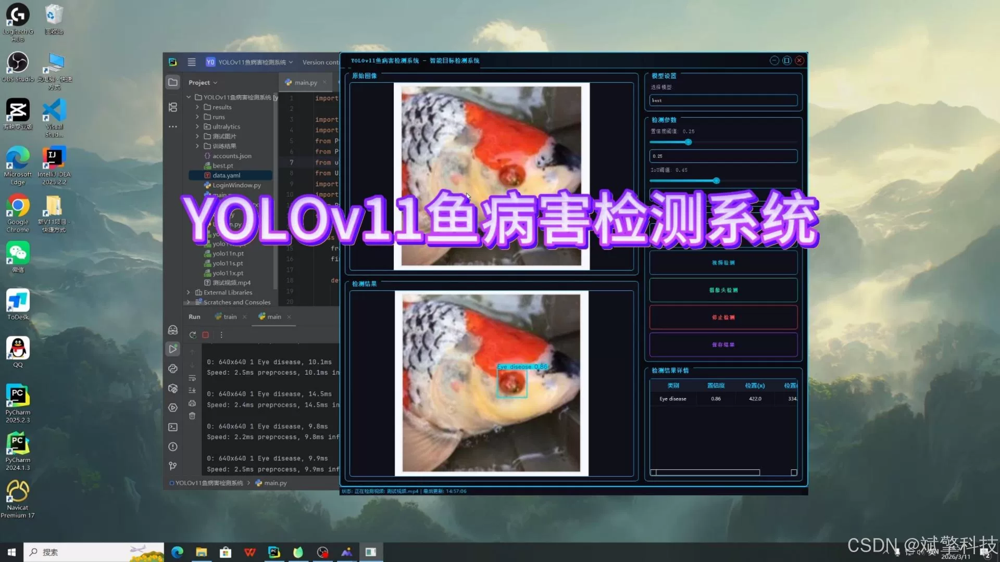
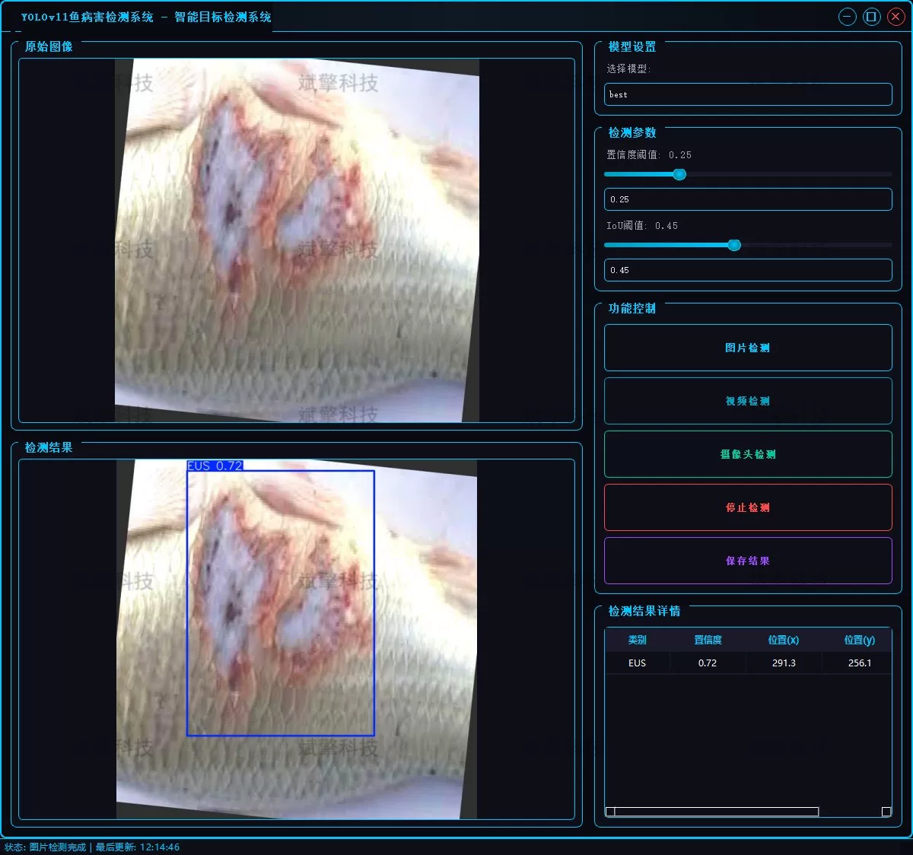
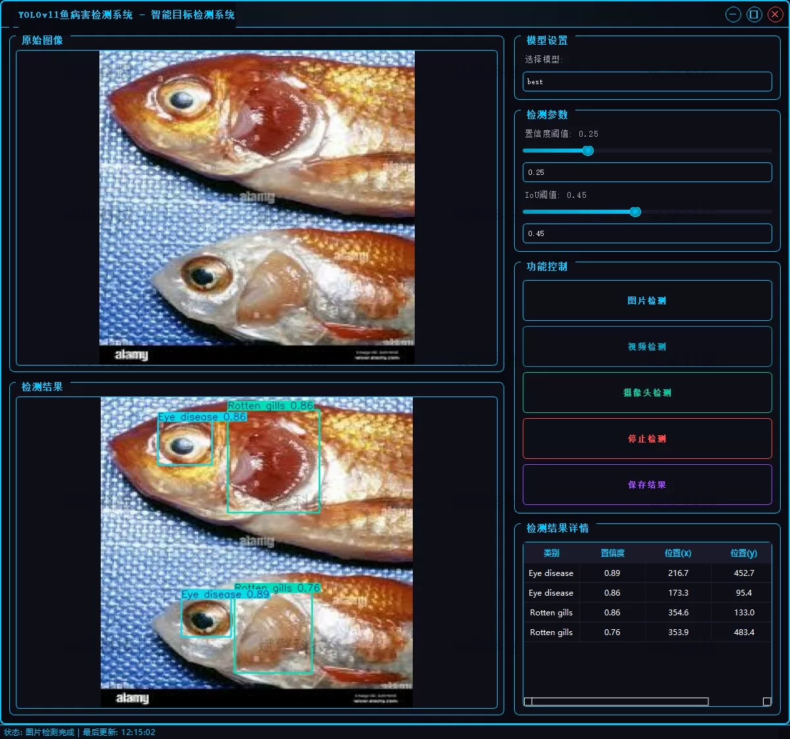
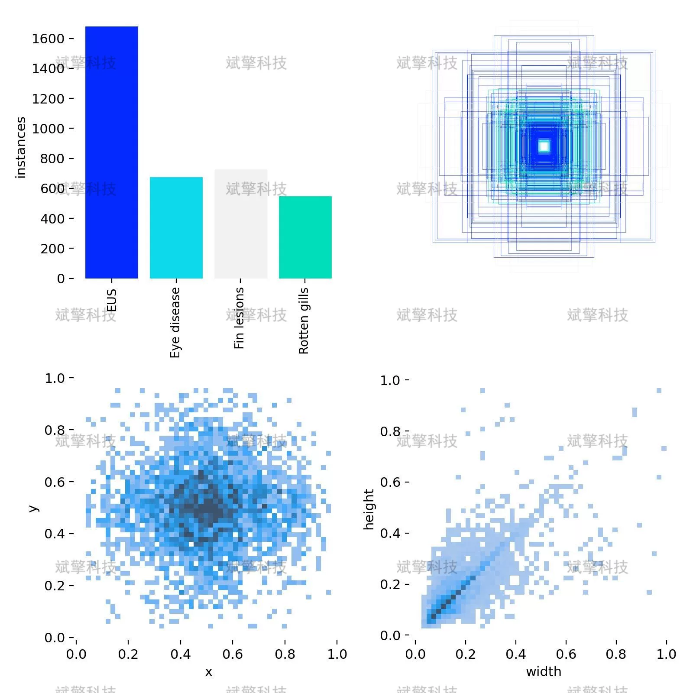
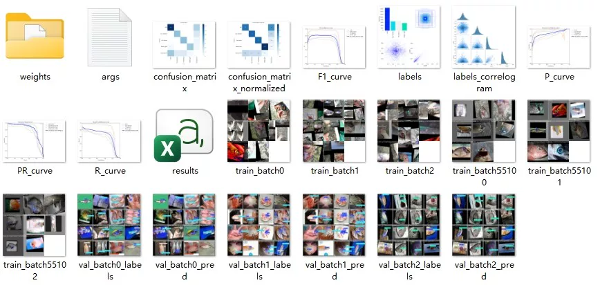
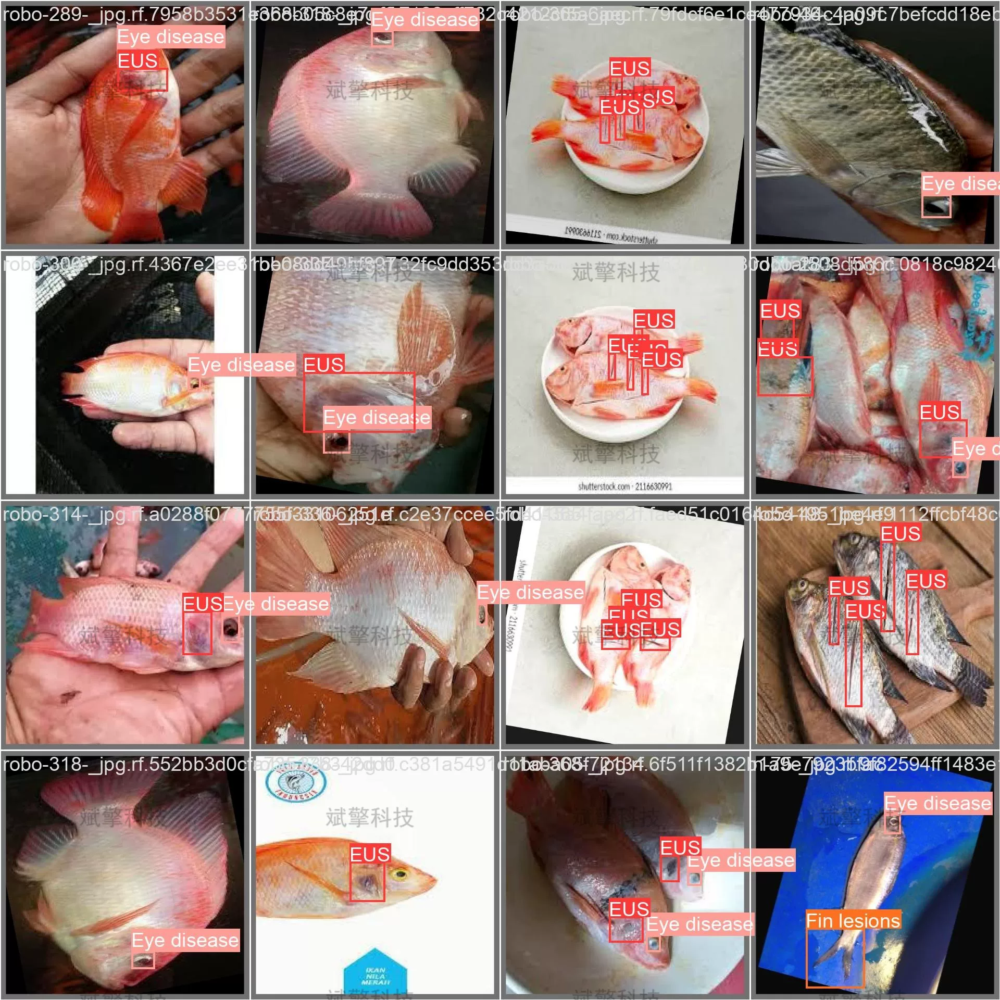

# YOLOv11 fish disease intelligent recognition system

## Body

YOLOv11 Fish Disease Intelligent Identification System Based on YOLOv11 Deep Learning for Fish Disease Detection and Early Warning (YOLOv11+YOLO dataset + UI interface + login registration interface + Python project source code + model)

With the rapid development of aquaculture industry, early detection and prevention of fish diseases have become key links to ensure the benefits of aquaculture and food safety. Traditional methods of detecting fish diseases rely heavily on manual observation, which is inefficient, subjective, and difficult to achieve real-time monitoring.

This study designs and implements an intelligent fish disease detection system based on the latest YOLOv11 deep learning algorithm, aiming to solve the problems of low efficiency and high missed rate in manual disease detection in aquaculture. The system can automatically identify four common fish diseases: Ulcerative Stomatitis (EUS), eye diseases, fin lesions, and gill rot. It provides three functional modes: image detection, video detection, and real-time camera detection, enabling rapid localization and identification of diseases. Experimental results show that the system has good detection accuracy and real-time performance on the test set, providing an intelligent solution for disease prevention and control in aquaculture.

Project Functionality Exhibition

✅ User Login and Registration: Supports password verification and security validation.

✅ Three Detection Modes: Based on the YOLOv11 model, supports image, video, and real-time camera detection, accurately identifying targets.

✅ Dual-screen comparison: Displays the original image and detection results on the same screen.

✅ Data Visualization: Real-time table displaying the category, confidence, and coordinates of detected targets.

✅ Intelligent Parameter Adjustment: Offers a confidence slide bar to dynamically optimize detection accuracy, adapting to different scene requirements.

✅ Sci-fi Interactive Interface: Dark theme combined with dynamic light effects, reducing visual fatigue and improving operational experience.

✅ Multi-thread High-performance Architecture: Independent detection thread ensures smooth operation, real-time status prompts, and no lag.

Dataset Introduction

Training set (Train): 2,321 images
Validation set (Validation): 255 images
Test set (Test): 290 images

## Images

## Payment

Here is a pay link on Stripe ( https://buy.stripe.com/3cs8yP7sY87d0vu9AB ). Please contact me lonlonago@foxmail.com after funding $89, and I will send you a complete data files , thank you!

